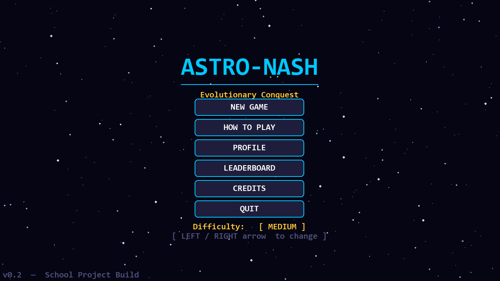
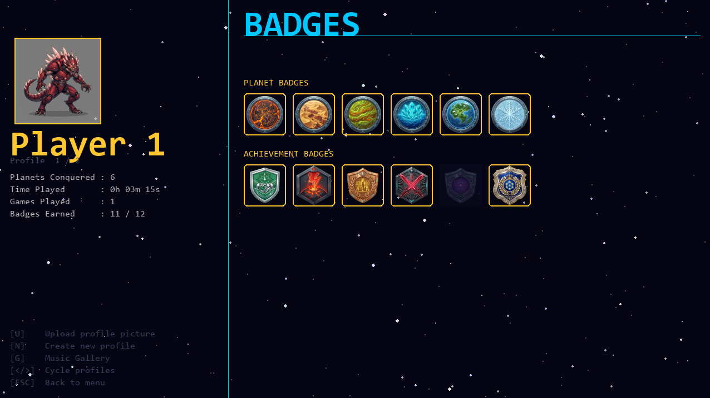
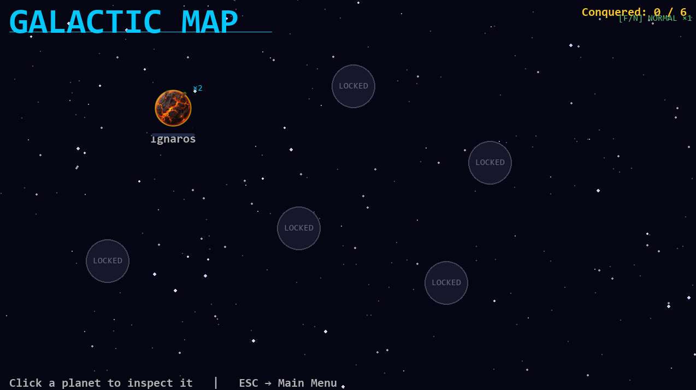
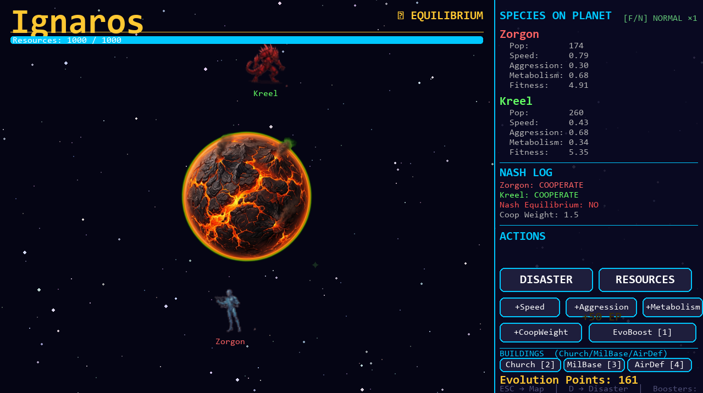

# Astro-Nash: Evolutionary Conquest

A pygame-based strategy game developed as a programming exam project for the
**Staatlich gepruefter Wirtschaftsinformatiker** course.

---

## Screenshots

### Start Screen


### Player Profile


### Galaxy Map


### Planet Simulation


---

## Overview

Astro-Nash: Evolutionary Conquest blends **evolutionary simulation** with
**Nash Equilibrium game theory**. Two alien species compete and cooperate on
planets across a galaxy. Your goal is to conquer all planets by guiding your
species toward stable cooperative equilibria.

---

## Features

- **Galactic Map** — explore and unlock planets as you progress
- **Species Evolution** — spend Evolution Points to upgrade speed, aggression, and metabolism
- **Nash Game Theory** — species interactions are modeled as iterated prisoner's dilemmas
- **Buildings** — construct Churches, Military Bases, and Air Defense installations
- **UFO Incursions** — defend planets in a real-time mini-game or auto-resolve
- **Disasters** — trigger chaos events to shake up stale equilibria
- **Profiles & Badges** — persistent player profiles with unlockable achievements
- **Leaderboard** — compete for the best planet conquest time
- **Music Gallery** — original AI-generated soundtrack with multiple dynamic tracks

---

## Controls

| Key | Action |
|-----|--------|
| `LEFT` / `RIGHT` | Cycle difficulty (Menu) |
| `M` | Toggle music mute |
| `P` | Pause menu (Map / Simulation) |
| `F` / `N` | Fast ×2 / Normal speed |
| `S` / `L` | Save / Load |
| `D` | Trigger disaster on selected planet |
| `ESC` | Back / Return to menu |

---

## Installation

**Windows & macOS**

```bash
pip install -r requirements.txt
python main.py
```

Requires **Python 3.10+** and **Pygame 2.x**. No platform-specific dependencies — runs natively on Windows and macOS.

---

## Project Structure

```
astro-nash_evolutionary_conquest/
├── main.py                 # Entry point and game loop
├── logic/                  # Core game logic (simulation, AI, buildings, …)
├── ui/                     # Rendering and UI screens
├── audio/                  # Music manager
├── assets/
│   ├── characters/         # Species sprites
│   ├── planets/            # Planet textures
│   ├── music/              # Soundtrack files
│   └── badges/             # Badge icons
└── requirements.txt
```

---

## Credits

**Game Design & Programming** — Julian Gast  
**AI-Assisted Development** — Claude Code (Anthropic)  
**Music Generation** — AI-Assisted

Built with purpose. Played with curiosity.
